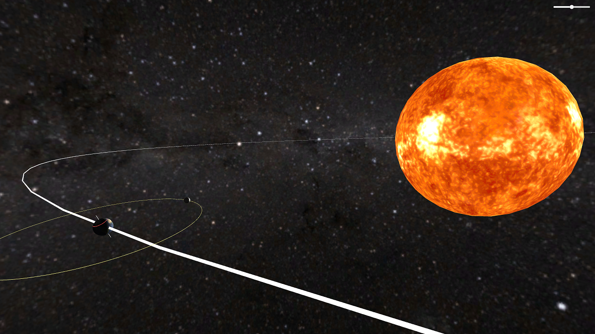

# 自転と公転を学ぶための習作

太陽の周りを地球が回って、地球の周りを月が回ります。
太陽の大きさ太陽と地球の距離比で100倍になっています。
地球の大きさと地球と月の間の距離も10倍程度大げさになっています。

Unityのエディタと同じような操作でカメラを動かすことができます。

[WebGLによる実行はこちら](https://imagire.github.io/Revolution/)

